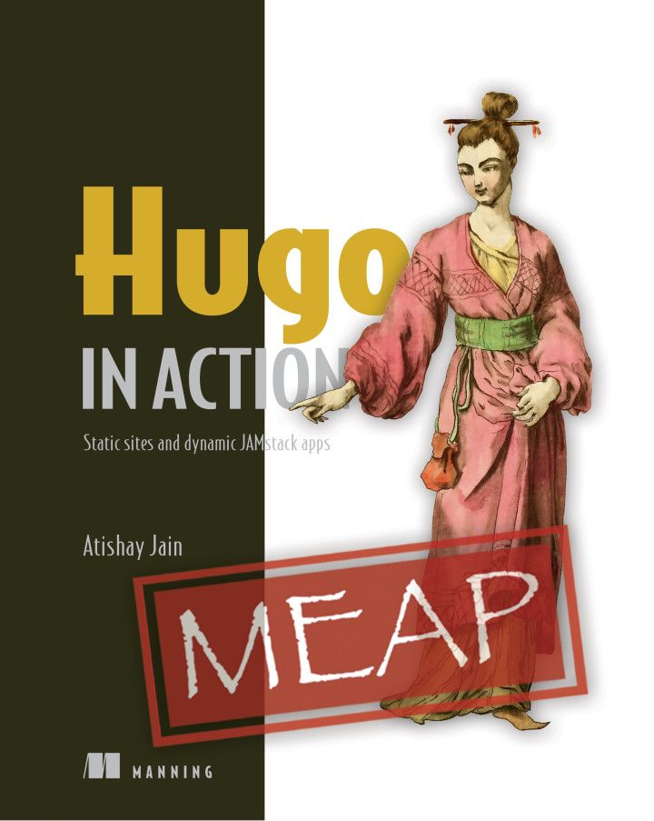

**原文：[External Learning Resources](https://gohugo.io/getting-started/external-learning-resources/)**

## 书籍

### Hugo In Action

《Hugo In Action》 是使用 Hugo 创建静态网站的分步指南。您将通过完整的网站和源代码示例，学习如何构建和托管一个低维护、高性能的网站，并在不依赖第三方服务器的情况下保持稳定。

[《Hugo In Action》主页](https://www.manning.com/books/hugo-in-action)

### Build Websites with Hugo

[Build Websites with Hugo - Fast Web Development with Markdown (2020)](https://pragprog.com/titles/bhhugo/)，作者是 Brian P. Hogan。

## 视频教程

### Mike Dane 的视频播放列表

Mike Dane 通过 [YouTube](https://www.youtube.com/watch?list=PLLAZ4kZ9dFpOnyRlyS-liKL5ReHDcj4G3&v=qtIqKaDlqXo) 上的视频教程解释了 Hugo 的各种功能。
